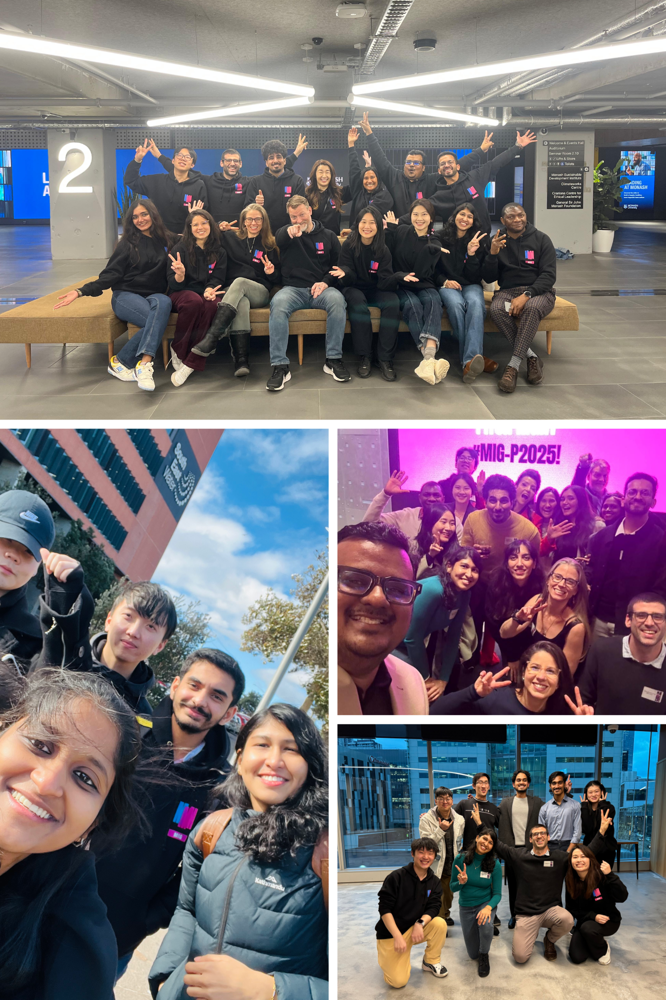

## Monash Innovation Guarantee-Undergraduate (MIG-UG)

In February 2025, I had the opportunity to serve as a coach in the Monash Innovation Guarantee – Undergraduate (MIG-U) program. During the program, I worked with a multidisciplinary team of undergraduate students as they explored real-world challenges and developed innovative solutions. It was inspiring to support them through the process—from early-stage problem exploration and ideation to refining their concepts and presenting their final pitches. Witnessing their curiosity, teamwork, and willingness to experiment was incredibly rewarding. I was especially proud that the team I mentored was awarded the Best Pitch, recognising the strength of their idea and the clarity with which they communicated their solution.

{width="700" height="600" fig-align="center"}

## Monash Innovation Guarantee-Postgraduate (MIG-P)

In July 2025, I had the privilege of serving as a coach in the Monash Innovation Guarantee Postgraduate (MIG-P) program. Over three inspiring weeks, I worked with a diverse cohort of master’s students as they tackled real-world, industry-defined challenges. It was an incredible experience to support their journey from exploration and ideation through to prototyping and pitching—witnessing their creativity, resilience, and ability to thrive in ambiguity.

{width="400" height="600" fig-align="center"}
